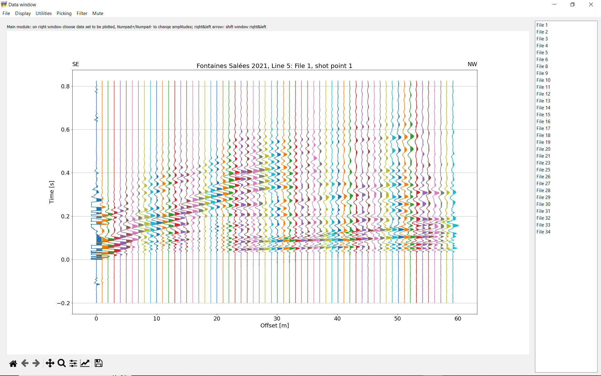
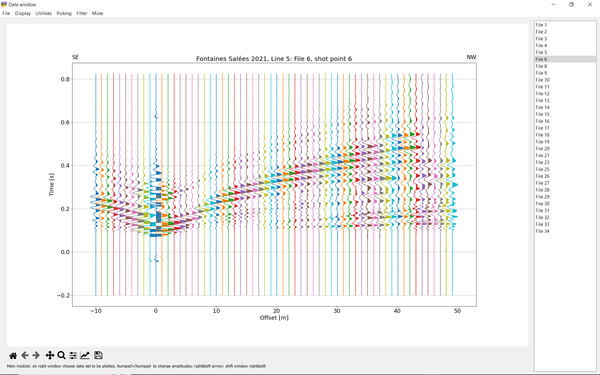
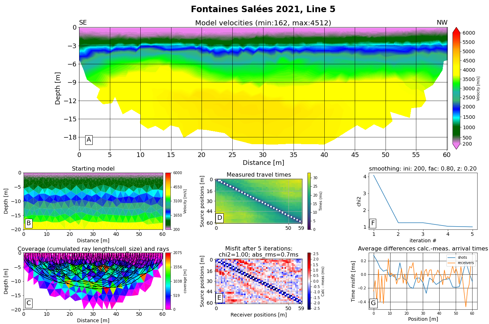

For the data in the given example, 60 geophones were placed at 1m distance from 0 to 59m. The GPS coordinates rotated and shifted to a local coordinate system starting at 0m are found in file “receivers.geo”. 31 Shots were fired every 2 m from 0 to 60m. Their local coordinates are found in file “shots.geo”.

The numbering of the files is not contiguous, because several shot were repeated and the bad files were deleted. So, although the file numbers go from 1 to 34, only 31 files are stored, one per shot point.

Several shots had bad trigger timing, triggering too early. In file “file_corrections.dat”, the time corrections are given for recorded files (not shot point numbers!) 6, 7, 8, 9, 11, 14, 18, 21, 25 and 26. In recorded file 23, a wrong shot point number was stored. This is also corrected by an entry in file “file_corrections.dat”. No corrections for specific receivers had to be applied, therefore, no file “receiver_corrections.dat” is present.

Finally, there is a file “picks.dat” containing picks already done by myself and a file “calc_picks.dat” containing calculated picks from a tomography model.

To test the program, you should copy all files into a folder which may be different from the program folder. Now, you may first store files file_corrections.dat, picks.dat and calc_picks.dat somewhere else (or change their names), just to see the original data with the wrong arrival times for the above-mentioned files.

Edit PyRefra.py: Find line starting with `sys_path =` (approx. line 70) and replace the existing path with the path to the folder where the program files are stored.
On the following line starting with `dir0 =`, you may replace the existing path with the one where the data files are stored.

Open spyder and within spyder open PyRefra.py and run the program,

Or open a command window (under Windows: Anaconda Prompt) and execute the following commands:

`cd` to the folder containing the program files

`conda activate pg`

`python PyRefra.py`

The program first asks you for a general title and the geographical direction in which the beginning of the line is placed. Choose whatever you like. Then the program asks for the data files you want to treat. Chose all available ones. Then the data from the first shot point show up, which correspond to those of file 1. Shot points 1 to 31 are available in the right window.

If you switch to file gather instead of shot gather, you will see that the available numbers change from 1 to 34, with a few missing numbers (missing files).

Click on File 6 in the right window and see the wrong trigger time:

Stop the program, copy file file_corrections.dat and calc_picks.dat (perhaps also picks.dat) back to the data folder and run again. The trigger time corrections are done, and you may explore the program and do some picking, creating a new file picks.dat. Try also plotting the calculated arrival times.

A tomography using the existing file picks.dat and the default options should give the following image except for the title (which you gave when calling the program for the first time):

