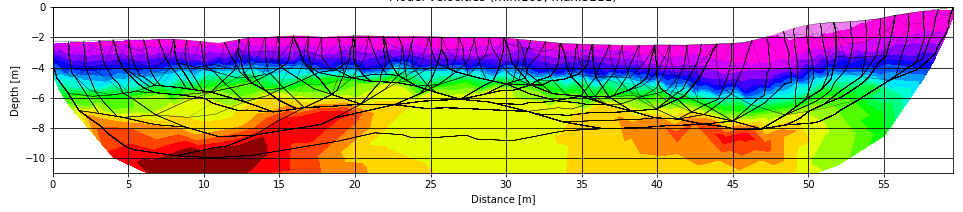

# PyRefra

Software package for treatment and tomography of multishot refraction seismic data. Working under Linux and Windows OS.

For installation instructions see [1. Installation instructions](./1_Installation.md).

[2_Data_preparation.md](./2_Data_preparation.md) describes file naming conventions and necessary geometry files.

[3_Running_PyRefra.md](./3_Running_PyRefra.md) is the main manual describing menu entries and other options.

All these instructions are combined in a file [PyRefra.pdf](./PyRefra.pdf).

Once installed, you can test and get familiar with the codes by using the [example](./example) folder. See Readme file there.
